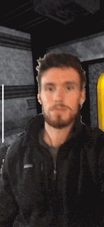

# arkit-virtual-backdrop
Superimposes your image into a 3D rendered world using Metal+ARKit.

This example calculates depth to viewer's face, and uses it to remove the background behind the viewer's head and body, replacing it with a 3D scene rendered in Metal. The viewer's image is rendered as a plane in front of the geometry using a Metal shader that passes through when the depth is beyond a threshold.

The depth distance to include behind the user's face is a work in progress, but accurately setting this value is the key to successful  compositing. A value too large causes background artifacts from the camera to appear in front of the rendered scene, and a value too small removes the user's body. Currently the value is calculated based on the camera's height in relation to the face, as well as the camera's angle.

Issues to be resolved/investigated further:

- Border around head and body is noisy
- Depth images are not recieved consistently
